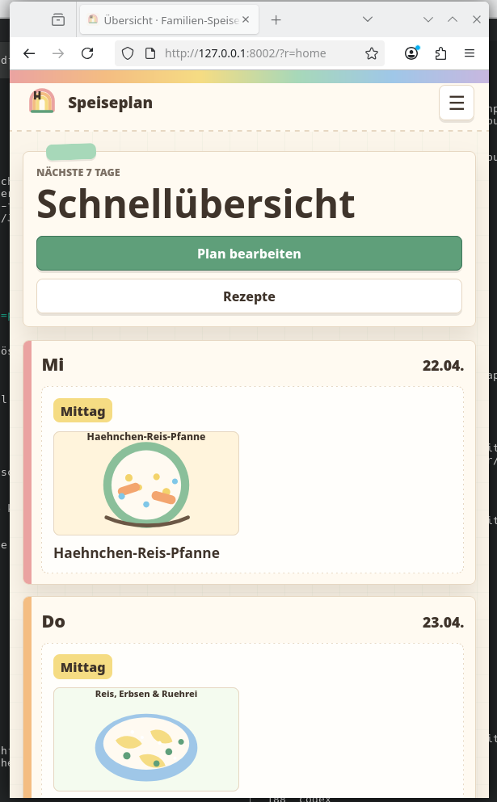
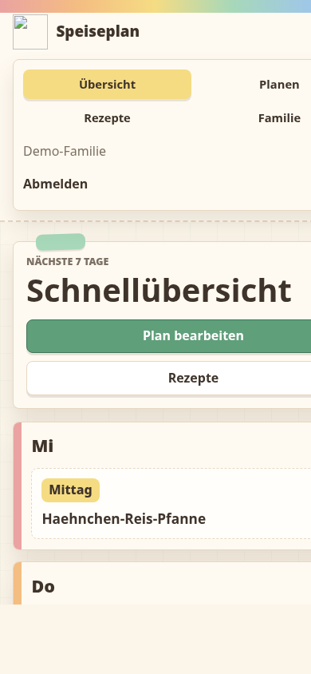
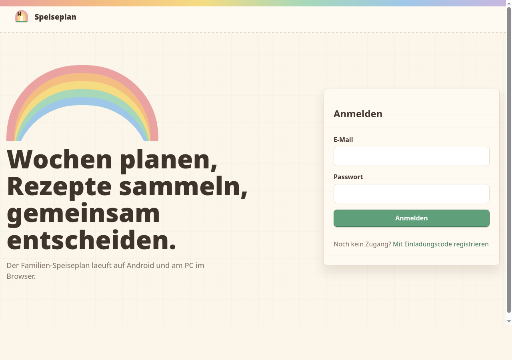

# Familien-Speiseplan


Eine kleine, selbst gehostete PHP/MariaDB-PWA fuer Familien, die ihren woechentlichen Speiseplan, Rezepte und Rezeptfotos gemeinsam verwalten wollen. Die App laeuft im Browser am PC und kann auf Android wie eine App auf den Startbildschirm gelegt werden.

## Screenshots

| Mobile Schnelluebersicht | Mobile Menueansicht |
| --- | --- |
|  |  |



## Funktionen

- **Schnelluebersicht:** mobile Startseite mit den naechsten 7 Tagen.
- **Wochenplanung:** Mittag und Abendbrot pro Tag planen.
- **Rezeptbuch:** strukturierte Rezepte mit Zutaten, Schritten, Kategorien, Tags, Dauer und Portionen.
- **Rezeptfotos:** Upload von JPG, PNG oder WebP; Auslieferung geschuetzt ueber die App.
- **Familien:** mehrere Familien/Haushalte mit getrennten Daten.
- **Einladungscodes:** neue Nutzer treten einer Familie per Code bei.
- **Vorschlaege:** einfache Rezeptvorschlaege aus dem eigenen Rezeptbuch.
- **PWA:** installierbar auf Android, nutzbar im Desktop-Browser.
- **Private Hosting:** keine Cloud-Pflicht, keine externen API-Abhaengigkeiten.

## Tech Stack

- PHP 8.2+
- MariaDB/MySQL
- PDO-MySQL
- Vanilla HTML/CSS/JavaScript
- Service Worker + Web App Manifest

Keine Composer- oder Node-Abhaengigkeiten erforderlich.

## Projektstruktur

```text
app/                    PHP-Logik, Views, Auth, Planner, Rezepte
config/                 Beispielkonfiguration, lokale config.php bleibt ignoriert
database/               Schema, Seed-Daten, Migrationen
docs/screenshots/       Bilder fuer GitHub/README
public/                 Webroot fuer Apache/Nginx/PHP-Server
storage/uploads/recipes Rezeptbilder; echte Uploads bleiben aus Git raus
```

Wichtig: Der Webserver muss auf `public/` zeigen, nicht auf den Projektordner.

## Quickstart Lokal

```sh
cp config/config.example.php config/config.php
```

In `config/config.php` Datenbankzugang eintragen.

Datenbank importieren:

```sh
mariadb -u root -p < database/schema.sql
mariadb -u root -p speiseplan < database/seed.sql
```

Lokalen PHP-Server starten:

```sh
php -S 0.0.0.0:8002 -t public
```

Dann oeffnen:

```text
http://127.0.0.1:8002/?r=login
```

Demo-Zugang:

```text
E-Mail: demo@example.test
Passwort: speiseplan
Einladungscode: FAMILIE2026
```

Die Seed-Daten legen eine Demo-Familie, Beispielrezepte, Tags, Plaene und einige Demo-Rezeptbilder an.

## MariaDB-User Fuer Produktion

Empfohlen ist ein eigener DB-User nur fuer diese App:

```sql
CREATE DATABASE speiseplan
  CHARACTER SET utf8mb4
  COLLATE utf8mb4_unicode_ci;

CREATE USER 'speiseplan_app'@'localhost'
  IDENTIFIED BY 'HIER_EIN_STARKES_PASSWORT';

GRANT ALL PRIVILEGES ON speiseplan.* TO 'speiseplan_app'@'localhost';
FLUSH PRIVILEGES;
```

Nach der Installation kann der User fuer den laufenden Betrieb enger berechtigt werden:

```sql
GRANT SELECT, INSERT, UPDATE, DELETE
ON speiseplan.* TO 'speiseplan_app'@'localhost';
```

## Deployment

### Apache Beispiel

```apache
<VirtualHost *:80>
    ServerName speiseplan.example.com
    DocumentRoot /var/www/speiseplan/public

    <Directory /var/www/speiseplan/public>
        AllowOverride All
        Require all granted
    </Directory>

    ErrorLog ${APACHE_LOG_DIR}/speiseplan-error.log
    CustomLog ${APACHE_LOG_DIR}/speiseplan-access.log combined
</VirtualHost>
```

Upload-Ordner beschreibbar machen:

```sh
chown -R www-data:www-data storage/uploads/recipes
chmod -R 775 storage/uploads/recipes
```

HTTPS aktivieren, z.B. mit Certbot:

```sh
certbot --apache -d speiseplan.example.com
```

Danach in `config/config.php` setzen:

```php
'force_https' => true,
```

### Unterordner-Deployment

Wenn die App unter `/speiseplan` laufen soll:

```php
'base_path' => '/speiseplan',
```

Der Alias muss trotzdem auf `public/` zeigen.

## Android Installation

1. App-URL in Chrome auf Android oeffnen.
2. Anmelden.
3. Chrome-Menue oeffnen.
4. `App installieren` oder `Zum Startbildschirm hinzufuegen` waehlen.

Fuer echte PWA-Installation ist HTTPS erforderlich.

## Sicherheit

Die App ist fuer private Nutzung gedacht und bringt grundlegende Schutzmechanismen mit:

- Passwort-Hashing mit PHP `password_hash`
- PDO Prepared Statements
- CSRF-Schutz fuer POST-Aktionen
- Session-ID-Regeneration beim Login
- familienbezogene Datenfilter
- geschuetzte Fotoauslieferung
- Login-/Registrierungs-Rate-Limits
- Security-Header
- Uploads nur fuer JPG, PNG und WebP

Produktiv beachten:

- HTTPS verwenden.
- Webroot ist nur `public/`.
- `config/config.php` niemals commiten oder oeffentlich ausliefern.
- Datenbankuser minimal berechtigen.
- Upload-Ordner nicht direkt als Webroot ausliefern.

## Migrationen

Bestehende Installationen nach Sicherheitsupdates aktualisieren:

```sh
mariadb -u speiseplan_app -p speiseplan < database/migrate_security_events.sql
```

## PWA / Cache Troubleshooting

Browser und Android-PWAs cachen CSS/JS aggressiv. Wenn nach einem Update alte Styles sichtbar bleiben:

1. App/Tab komplett schliessen und neu oeffnen.
2. Im Browser einmal hart neu laden.
3. Bei installierter PWA notfalls App-Cache in Android loeschen.

Fuer kuenftige Aenderungen sollte die Asset-Version bzw. Service-Worker-Version erhoeht werden.

## Entwicklung

Syntaxcheck:

```sh
find . -name '*.php' -print0 | xargs -0 -n1 php -l
```

Lokaler Server:

```sh
php -S 127.0.0.1:8002 -t public
```

## Lizenz

GNU General Public License (GPL)
